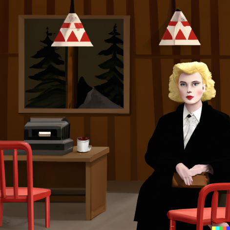

[Kliknij na mnie :O](./another-page.html).

# O Mnie

Nazywam się Jakub Zięba i jestem studentem I roku **cyberbezpieczeństwa** na AGH, ukończyłem Technikum Elektroniczone w _Lublinie_. Moim ulubionym cytatem jest cytat z Twin Peaks: `In real life there is no algebra.`

# Moje zainteresowania

> Bardzo lubię robić szkice dowodów
>
> Nie przepadam za dowodem prawostronnym
> 
> Nie lubie gdy odwzorowanie nie jest `liniowe` >:[
> 
> Twin Peaks i David Lynch

# SQL
```js
uName = getRequestString("username");
uPass = getRequestString("userpassword");

sql = 'SELECT * FROM Users WHERE Name ="' + uName + '" AND Pass ="' + uPass + '"'
```
# Pomocne linki

*   [Poczta](https://poczta.agh.edu.pl/).
*   [Otlichnyj_Gorshok](https://github.com/AGH-Wstep-do-Informatyki-2022-2023/Otlichnyj-Gorshok).
*   [Katarushka](https://kataroushka.com/).

# Tier Lista (filmy i seriale)

| Film/Serial                   | Reżyser                      |
|:------------------------------|:-----------------------------|
| Twin Peaks Season 1           | David Lynch, Mark Frost      | 
| Twin Peaks Season 2           | David Lynch, Mark Frost      | 
| Twin Peaks: Fire Walk with Me | David Lynch, Mark Frost      | 
| 1899                          | Baran bo Odar, Jantje Friese | 
| W.I.T.C.H.                    | David Lynch (musiał)         |

# Galeria sztuki

